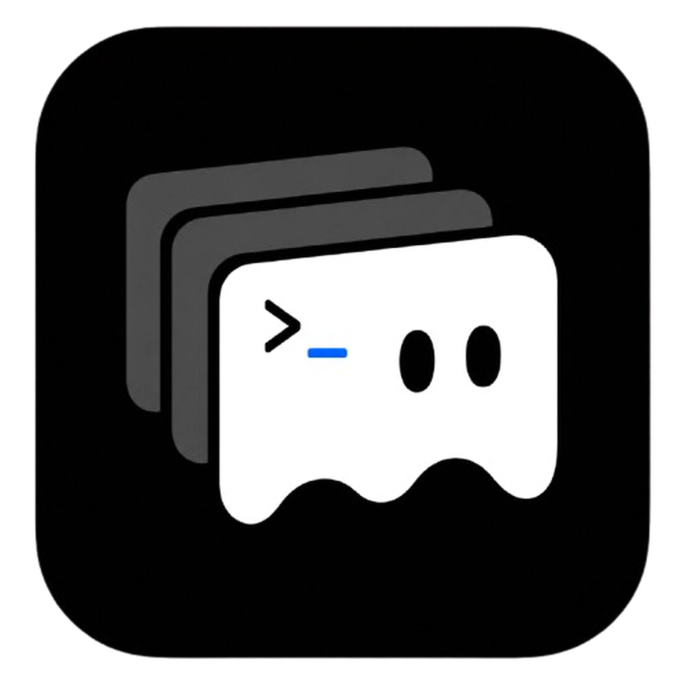

<p align="center">
  
</p>

<h1 align="center">ProGhostty</h1>

<p align="center">
  <strong>The macOS terminal for people who live in shells — and AI CLIs.</strong><br>
  Real PTY. Ghostty VT semantics. Smooth history that stays out of your way.
</p>

<p align="center">
  <a href="https://github.com/freecodetiger/ProGhostty/releases/latest"></a>
  <a href="Package.swift"></a>
  <a href="Package.swift"></a>
  <a href="LICENSE"></a>
  <a href="https://github.com/freecodetiger/ProGhostty/stargazers"></a>
</p>

<p align="center">
  <a href="#install">Install</a> ·
  <a href="#why-proghostty">Why</a> ·
  <a href="#what-you-get">What you get</a> ·
  <a href="#build-from-source">Build</a> ·
  <a href="#architecture">Architecture</a> ·
  <a href="#contributing">Contributing</a>
</p>

---

ProGhostty is a **native macOS terminal you can use as a daily driver**: fork real shells, speak real VT, split workspaces, and read long Codex / Claude sessions without the viewport fighting you.

It does **not** reinvent your shell. zsh, fish, prompt, tmux, vim, fzf, htop, Codex, Claude Code — same PTY path you already trust.

> **Not affiliated with Ghostty.** We vendor Ghostty and run **`libghostty-vt`** as the terminal semantics engine. Product UI stays on the right side of that boundary.

---

## Install

Ship builds on every tagged release. **Start here:**

### [↓ Download the latest DMG](https://github.com/freecodetiger/ProGhostty/releases/latest)

```bash
# or build from source
git clone --recursive https://github.com/freecodetiger/ProGhostty.git
cd ProGhostty
# see Build from source
```

| | |
|--|--|
| **Signing** | Ad-hoc (open-source releases). First launch may need **Right-click → Open** or *Privacy & Security → Open Anyway*. |
| **Updates** | In-app check opens the matching GitHub Release when a new `v*` ships. |
| **Platform** | macOS **14+**, Apple Silicon & Intel via SwiftPM (release DMG tracks CI). |

---

## Why ProGhostty?

Terminals fail in two boring ways:

1. **Pretty UI, soft VT** — a second parser in the app layer slowly disagrees with reality.  
2. **Correct VT, hostile history** — you’re halfway through a long AI answer and the view snaps to live tail.

ProGhostty is built so those two failure modes stay rare:

| Pillar | What it means in practice |
|--------|---------------------------|
| **Semantics first** | Cursor, scrollback, styles, ANSI — **`libghostty-vt` is the only truth**. Swift never re-parses the stream. |
| **Architecture that holds** | Strict App → Core → PTY → VT → Renderer chain; Core **cannot** import SwiftUI (CI guard). |
| **History that works** | Pattern‑2 smooth pixel scroll: browse without freezing new output, return to live without false bottoms. |
| **Your shell stays yours** | No mandatory plugin takeover, no “managed” dotfiles. Enhancements are opt-in. |

If you want **macOS-native chrome** on **honest terminal plumbing**, you’re in the right repo.

---

## What you get

### Daily driver

- **Real PTY panes** — independent processes, proper resize, signals, full-screen TUIs.
- **Ghostty VT core** — battle-tested parse & state, not a hobby ANSI subset.
- **Metal-first rendering** — direct draw path for smooth scroll; cell-grid / text fallback when needed.
- **Workspaces & splits** — multi-pane layouts, multiple workspaces, predictable focus.
- **Themes that cohere** — Default + **Soft Dark / Soft Light**; title bar and settings follow the terminal palette.
- **Path-aware UX** — drop paths into the pane; **⌘-click** files to reveal in Finder.
- **Useful title bar** — workspace + focused pane directory; hover for full path.

### Built for AI CLIs (without special-casing reality)

- **Stable long-output reading** — scroll history while agents keep printing; no “freeze the world” history mode as the happy path.
- **Shift+Enter multi-line** where TUIs expect it; Enter still submits.
- **Side input** — open a lightweight input while browsing history; Enter pastes into the real session without jumping your viewport.
- **Optional task notifications** — agent Stop hooks → toast / sound / system notify (**off by default**, install with consent).

### Hard lines we won’t cross

- No second VT truth in Swift  
- No default hijack of your shell config  
- No feature that only works by scraping terminal text when the VT already knows

---

## Roadmap (open source, not “unfinished”)

ProGhostty **ships continuous `v0.4.x` releases** with scroll stability, themes, notifications, and AI-CLI polish already in the box. Open source means the backlog is public and movable — not that the app is a prototype.

**Coming next (community-shaped):** notarized / wider distribution options, richer theme import, more workspace power tools, contributor-driven fixes.

Track work and ideas: [Issues](https://github.com/freecodetiger/ProGhostty/issues) · [Releases](https://github.com/freecodetiger/ProGhostty/releases).

---

## Build from source

### Requirements

| Tool | Notes |
|------|--------|
| macOS **14+** | App target |
| **Swift 6.1** | Language mode `.v6` |
| **Zig 0.15.2** | Vendored `libghostty-vt` |
| **Xcode** | App bundle / signing tooling |
| **Git submodules** | `Vendor/ghostty` |

### 1. Submodules

```bash
git submodule update --init --recursive
```

### 2. Build `libghostty-vt` (**ReleaseFast — required**)

A Debug VT library makes parsing pathologically slow. Always use ReleaseFast:

```bash
cd Vendor/ghostty
zig build \
  --global-cache-dir ../../.zig-cache-global \
  -Demit-lib-vt=true \
  -Demit-xcframework=false \
  -Doptimize=ReleaseFast
```

Full notes: [`docs/libghostty-vt.md`](docs/libghostty-vt.md).

### 3. Compile, test, architecture guard

```bash
swift build
swift test
scripts/check-architecture.sh
```

### 4. Run the app people actually ship

`swift build` alone does **not** refresh the `.app` bundle. For a real launch:

```bash
./scripts/build-app-bundle.sh release
open .build/arm64-apple-macosx/release/ProGhostty.app
```

---

## Architecture

One pipeline. One owner per concern.

```text
PTY bytes
  → PTYTerminalEngine           session lifecycle & I/O
  → GhosttyVTBridge.write
  → libghostty-vt               ★ sole terminal state
  → frame / scrollFrame / rows(at:)
  → TerminalRenderFrame         immutable snapshot
  → Metal direct | cell-grid | text fallback
```

| Concern | Owner |
|---------|--------|
| PTY / sessions | `PTYTerminalEngine` |
| VT state | `libghostty-vt` via `GhosttyVTBridge` |
| Smooth browse | `SmoothScrollEngine` + browse present |
| Pixels | Metal / cell-grid backends (paint only) |
| Workspaces | `PaneWorkspaceController` |

Deep dive: [`docs/architecture/ownership-map.md`](docs/architecture/ownership-map.md) · agent rules: [`CLAUDE.md`](CLAUDE.md).

```text
Sources/
  ProGhosttyApp/        macOS app, settings, windows
  ProGhosttyCore/       PTY, VT bridge, renderer, workspace
  ProGhosttyGhosttyVT/  C surface for libghostty-vt
  ProGhosttyPTY/        forkpty / resize helpers
  ProGhosttyPG/         `pg` helper CLI

Vendor/ghostty/         vendored Ghostty (MIT)
Tests/                  swift-testing
scripts/                bundle, DMG, architecture guard
```

---

## Contributing

**Contributions are welcome** — from one-line docs to scroll/VT hard problems.

| You care about… | Jump in on… |
|-----------------|-------------|
| Daily-driver bugs | Repro + PR or detailed issue |
| Scroll / split / resize | Pattern‑2 + pane layout |
| Themes & settings chrome | Cohesive palettes, a11y contrast |
| Docs & onboarding | Screenshots, build tips, translations |
| Tests | Pure value types & scroll resolvers |

### PR checklist

```bash
swift build && swift test && scripts/check-architecture.sh
# UI / renderer? also:
./scripts/build-app-bundle.sh release   # hand-test the .app
```

In the description: **user-visible behavior**, **layer touched** (PTY / VT / renderer / workspace / settings), **how you tested**.

Commits: Conventional Commits — see [`docs/git-workflow.md`](docs/git-workflow.md).

---

## Community

- [Issues](https://github.com/freecodetiger/ProGhostty/issues) — bugs & ideas  
- [Releases](https://github.com/freecodetiger/ProGhostty/releases) — DMGs & notes  
- ⭐ **Star the repo** if ProGhostty is your daily terminal — it helps the next person find a VT-honest macOS app.

<p align="center">
  <a href="https://github.com/freecodetiger/ProGhostty/releases/latest"><strong>Download</strong></a>
  &nbsp;·&nbsp;
  <a href="https://github.com/freecodetiger/ProGhostty/stargazers"><strong>Star</strong></a>
  &nbsp;·&nbsp;
  <a href="https://github.com/freecodetiger/ProGhostty/issues/new"><strong>Report / request</strong></a>
</p>

---

## License

**[MIT](LICENSE)** for ProGhostty.

Vendored Ghostty: **MIT** — [`Vendor/ghostty/LICENSE`](Vendor/ghostty/LICENSE).

---

<p align="center">
  <sub>
    Native Swift · <code>libghostty-vt</code> · real PTY · made for people who don’t leave the terminal<br>
    中文界面 · English docs for the global community
  </sub>
</p>
